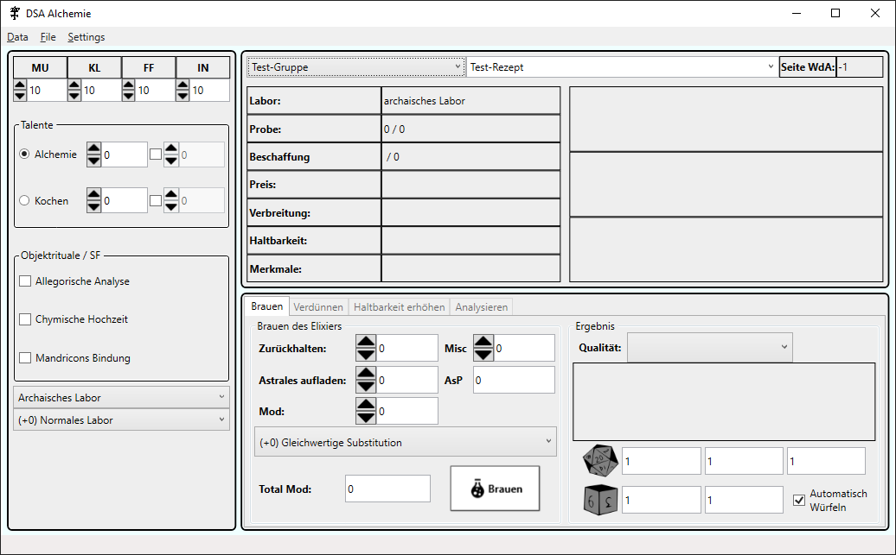

# DSA 4.1 Alchemie Tool
## Introduction
Provide a User Interface to assist in everything Alchemical in DSA.

It is currently entirely in German and using DSA 4.1 Rules.

A switch to DSA 5 Rules or English is currently not planned until there is demand.
## Installation
1. Install [.NET 5.0](https://dotnet.microsoft.com/download/dotnet/5.0/runtime)
2. Download latest release
3. Start executable
### Preview

## Features
* UI to create an Elixir
* [TODO] UI for qualified dillution
* [TODO] UI for extending durability
* [TODO] UI for analysis of Exlixirs
* Ability to keep Character values accross sessions
* Automatic check for Updates via GitHub API
## Technologies
This Application is written in .NET 5.0 C# & WPF without external dependecies.